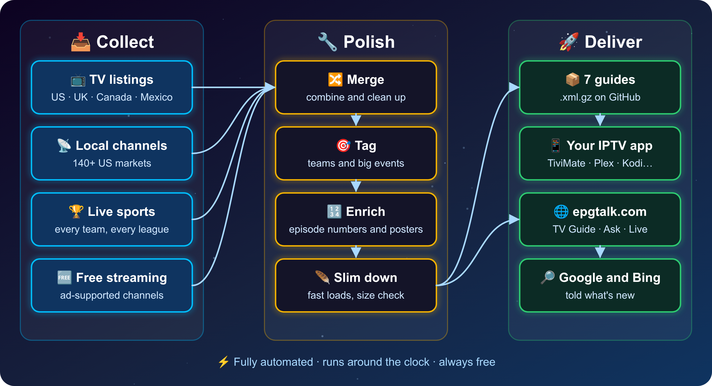

<div align="center">


[](https://github.com/acidjesuz/EPGTalk)

<br>

[](https://github.com/acidjesuz/EPGTalk/stargazers)
[](https://github.com/acidjesuz/EPGTalk/network/members)
[](https://github.com/acidjesuz/EPGTalk/commits/master)
[](https://epgtalk.com)
[](https://epgtalk.com/channels.html)
[](#-your-epg-urls)

[](https://github.com/acidjesuz/EPGTalk)
[](https://github.com/acidjesuz/EPGTalk)
[](https://github.com/acidjesuz/EPGTalk)
[](STATUS.md)

<br>

> 🇲🇽 **[Versión en Español → README_ES.md](README_ES.md)**

🇺🇸 &nbsp;**US Channels**&nbsp; &bull; &nbsp;🇬🇧 &nbsp;**UK Channels**&nbsp; &bull; &nbsp;🇨🇦 &nbsp;**Canada**&nbsp; &bull; &nbsp;🇲🇽 &nbsp;**Latino / Mexico**&nbsp; &bull; &nbsp;📡 &nbsp;**140+ US Local Markets**&nbsp; &bull; &nbsp;🏆 &nbsp;**Every Sports Team**&nbsp; &bull; &nbsp;🆓 &nbsp;**Free TV**

<b>On the web:</b> &nbsp;[🔎 Ask EPGTalk](https://epgtalk.com/ask.html) · [📺 TV Guide](https://epgtalk.com/tvguide.html) · [🔴 Live Sports](https://epgtalk.com/live.html) · [🏆 Big Events](https://epgtalk.com/events.html) · [🎉 Holiday Movies](https://epgtalk.com/season.html) · [🛋️ TV Mode](https://epgtalk.com/tv.html) · [📖 Player Setup](https://epgtalk.com/setup.html)

<br>

</div>

---

> ⚠️ **I provide free EPG for LEGAL use Only!!!**
>
> TV guides are not perfect, and neither am I. Please wait **24 hours** before reporting an issue — most problems fix themselves on the next nightly update.

---

## 📌 Quick Links

> **Jump straight to what you need:**

| | | | |
|:-:|:-:|:-:|:-:|
| [🔗 **Grab Your URL**](#-your-epg-urls) | [⚡ **Quick Setup**](#-quick-setup--60-seconds-flat) | [📊 **Live Stats**](#-live-guide-stats) | [📡 **US Local Markets**](#-us-local-coverage--140-markets) |
| [🏆 **Compatible Apps**](#-compatible-apps) | [❓ **FAQ**](#-faq) | [💬 **Community**](#-community--support) | [📋 **Status Page**](STATUS.md) |
| [⏱ **Now & Next**](https://epgtalk.com/now.html) · [📺 **TV Guide**](https://epgtalk.com/tvguide.html) | [🔎 **Channel Finder**](https://epgtalk.com/channels.html) | [🏆 **Sports Guide**](#-your-epg-urls) | [🔴 **Live Sports**](https://epgtalk.com/live.html) |
| [📅 **Team Calendars**](https://epgtalk.com/calendars/) | [🌟 **Tonight's Picks**](https://epgtalk.com/tonight.html) | [🔧 **Playlist Checker**](https://epgtalk.com/playlist.html) | [🏆 **Big Events**](https://epgtalk.com/events.html) |
| [🔎 **Ask EPGTalk**](https://epgtalk.com/ask.html) | [📖 **Player Setup**](https://epgtalk.com/setup.html) | [🛋️ **TV Mode**](https://epgtalk.com/tv.html) · [🆓 **Free TV**](https://epgtalk.com/antenna.html) | [🤓 **Public JSON**](https://epgtalk.com/api.html) |

> 🧰 **New:** [**Make your own guide**](#-make-your-own-guide--guide-builder-app) with the free Guide Builder app for Windows & Linux.

---

## 🟢 Live Guide Stats

> 📊 Stats update automatically every night after each guide push.
> &nbsp;&nbsp;&nbsp;📋 **[→ View Full Live Status Page](STATUS.md)**

<!-- EPG-STATS-START -->
### 📊 EPG Stats — Last updated: 2026-10-10 21:30 CDT

| Guide | 📺 Channels | 📄 Programs | 🗓 Coverage | 📦 Size | 🕒 Updated |
|-------|-------------|-------------|------------|---------|------------|
| 🇺🇸🇬🇧🇲🇽 **Combined** | 1,674 | 60,796 | Oct 10, 12:00 → Oct 12, 21:59 | 43.9 MB | 05:58 PM |
| 🇺🇸 **US Guide** | 740 | 127,867 | Oct 09, 23:00 → Oct 17, 04:58 | 13.8 MB | 12:26 AM |
| 🇬🇧 **UK Guide** | 535 | 94,825 | Oct 10, 00:00 → Oct 17, 04:57 | 9.6 MB | 12:34 AM |
| 🇲🇽 **Latino / Mexico** | 603 | 104,690 | Oct 10, 02:00 → Oct 17, 04:59 | 10.0 MB | 12:38 AM |
| 🇺🇸 **US Local** | 291 | 25,511 | Oct 10, 05:30 → Oct 14, 00:30 | 2.1 MB | 09:30 PM |
| 🏆 **Sports** | 525 | 5,242 | Oct 10, 12:00 → Oct 17, 21:30 | 110.8 KB | 05:40 PM |
| 🆓 **Free TV** | 1,169 | 98,408 | Oct 10, 03:58 → Oct 13, 10:59 | 6.6 MB | 06:34 AM |
<!-- EPG-STATS-END -->

---

## 🌎 About EPGTalk

<div align="center">

### 🚀 9 Years · Thousands of Users · 100% Free · Never Stopping

</div>

EPGTalk has been serving the IPTV community since **2017** — built and maintained by **one person** purely out of love for the community. What started as a small guide on the IPTVTalk forum has grown into one of the most comprehensive free EPG sources available anywhere.

Whether you're watching **Sunday Night Football**, **Premier League**, **EastEnders**, or **Liga MX** — this guide has you covered with up to **7 days of fresh listings**, pushed to GitHub automatically every single night without fail.

<div align="center">

| 🔄 Daily Updates | 📅 7-Day Listings | 📦 Compressed & Fast | 🆓 Always Free | 📡 140+ Local Markets |
|:-:|:-:|:-:|:-:|:-:|
| Every single night | Plan your whole week | `.gz` loads instantly | No accounts, ever | Full US local coverage |

</div>

---

## 🔗 Your EPG URLs

> 📋 **Copy your URL → Paste into app → Done.** It's that simple.

| Guide | What You Get | Coverage | URL |
|-------|-------------|----------|-----|
| 🇺🇸🇬🇧🇲🇽 **Combined** | Everything in one file | US + UK + Mexico | `https://raw.githubusercontent.com/acidjesuz/EPGTalk/master/guide.xml.gz` |
| 🇺🇸 **US Guide** | Full US national lineup | 7 days | `https://raw.githubusercontent.com/acidjesuz/EPGTalk/master/US_guide.xml.gz` |
| 🇬🇧 **UK Guide** | Full UK national lineup | 7 days | `https://raw.githubusercontent.com/acidjesuz/EPGTalk/master/UK_guide.xml.gz` |
| 🇲🇽 **Latino / Mexico** | Spanish-language channels | 7 days | `https://raw.githubusercontent.com/acidjesuz/EPGTalk/master/Latino_guide.xml.gz` |
| 📡 **US Local** | 140+ local US markets | 72 hours | `https://raw.githubusercontent.com/acidjesuz/EPGTalk/master/US_local_guide.xml.gz` |
| 🏆 **Sports** | Every team: NFL, NBA, MLB, NHL & more | 7 days | `https://raw.githubusercontent.com/acidjesuz/EPGTalk/master/Sports_guide.xml.gz` |
| 🆓 **Free TV** | 1,100+ free streaming channels — Pluto TV, Samsung TV Plus, Plex & Tubi | 3 days | `https://raw.githubusercontent.com/acidjesuz/EPGTalk/master/FreeTV_guide.xml.gz` |
| 🪶 **US Lite** | Same US channels, ~4× smaller — for Firestick & older boxes | 48 hours | `https://raw.githubusercontent.com/acidjesuz/EPGTalk/master/US_lite.xml.gz` |
| 🪶 **UK Lite** | Same UK channels, small & fast | 48 hours | `https://raw.githubusercontent.com/acidjesuz/EPGTalk/master/UK_lite.xml.gz` |
| 🪶 **Latino Lite** | Same Spanish-language channels, small & fast | 48 hours | `https://raw.githubusercontent.com/acidjesuz/EPGTalk/master/Latino_lite.xml.gz` |

> 🌐 **Same guides on our own domain** — use whichever you prefer, both update at the same time:
> `https://epgtalk.com/guide.xml.gz` · `https://epgtalk.com/US_guide.xml.gz` · `https://epgtalk.com/UK_guide.xml.gz` · `https://epgtalk.com/Latino_guide.xml.gz` · `https://epgtalk.com/US_local_guide.xml.gz` · `https://epgtalk.com/Sports_guide.xml.gz` · `https://epgtalk.com/US_lite.xml.gz` · `https://epgtalk.com/UK_lite.xml.gz` · `https://epgtalk.com/Latino_lite.xml.gz` · `https://epgtalk.com/FreeTV_guide.xml.gz` · `https://epgtalk.com/guide.xml`

> 💡 **First time?** Start with **Combined** — everything in one URL, works with every app.
>
> 📝 **App doesn't support `.gz`?** No problem, use the uncompressed version:
> `https://raw.githubusercontent.com/acidjesuz/EPGTalk/master/guide.xml`

---

## 📊 Guide Comparison

| Feature | 🇺🇸🇬🇧🇲🇽 Combined | 🇺🇸 US | 🇬🇧 UK | 🇲🇽 Mexico | 📡 US Local | 🏆 Sports | 🆓 Free TV |
|---------|:-:|:-:|:-:|:-:|:-:|:-:|:-:|
| **Channels** | 1600+ | 600+ | 500+ | 600+ | 140+ | 500+ | 1100+ |
| **Coverage** | 48 hrs | 7 days | 7 days | 7 days | 72 hrs | 7 days | 3 days |
| **US National** | ✅ | ✅ | — | — | — | — | — |
| **UK National** | ✅ | — | ✅ | — | — | — | — |
| **Mexico / Latino** | ✅ | — | — | ✅ | — | — | — |
| **US Local Markets** | — | — | — | — | ✅ | — | — |
| **Sports Teams** | ✅ | — | — | — | — | ✅ | — |
| **Free streaming (Pluto, Samsung, Plex, Tubi)** | — | — | — | — | — | — | ✅ |
| **Compressed** | ✅ | ✅ | ✅ | ✅ | ✅ | ✅ | ✅ |
| **Auto Updated** | Every 6 hrs | Every 2 days | Every 2 days | Every 2 days | Daily | Every 6 hrs | Daily |

> 🪶 **Lite versions** of US, UK and Latino (`US_lite`, `UK_lite`, `Latino_lite`): same channels, next 48 hours, about 4× smaller — made for Firestick and older boxes, refreshed about every 6 hours.

---

## ⚡ Quick Setup — 60 Seconds Flat

> ✅ **Works with:** TiviMate · Kodi · Perfect Player · GSE IPTV · OTT Navigator · IPTV Smarters · Sparkle TV · Channels DVR · and **any** XMLTV-compatible app

**1️⃣** &nbsp; Open your app → **Settings** → **TV Guide** or **EPG**

**2️⃣** &nbsp; Tap **Add Source** / **EPG URL** / **Import Guide**

**3️⃣** &nbsp; Paste your URL from the table above

**4️⃣** &nbsp; **Save** → Restart or refresh

**5️⃣** &nbsp; 🎉 **Full listings loaded — enjoy!**

> 📖 **Want the exact taps for your app?** The [Player Setup](https://epgtalk.com/setup.html) page has step-by-step guides for TiviMate, IPTV Smarters, Kodi, Plex, Jellyfin, Emby and Channels DVR — with the right address filled in.

---

## 🧰 Make Your Own Guide — Guide Builder App

> **Want a guide made just for your provider and channels?** The free **EPGTalk Guide Builder** app for **Windows** and **Linux** builds it on your own computer.

- 📡 Type your zip code, pick your TV provider (cable, satellite or antenna) and tick your channels — with logos
- 📲 Press **Build** — your TV box loads the guide straight from your computer (it keeps sharing in the background)
- 📺 Built-in TV guide with search, and a playlist fixer that matches your `.m3u` to the guide
- 🕓 A fresh guide every day, one-click updates, English & Español, light & dark look
- 🖥️ **NAS / Docker version (2.1):** run it 24/7 on your NAS or home server with Docker (Synology, QNAP, Unraid…) and manage it from any browser — [set it up](https://epgtalk.com/builder/#nas)
- 🏆 **New in 1.4:** add the free EPGTalk guides and keep just the channels you want — your own teams from Sports, a few Pluto channels from Free TV — for a smaller guide that loads fast on a Firestick

**➡️ [Download the Guide Builder](https://epgtalk.com/builder/)** — free, no account. Already use mc2xml? Import your `.dat` / `.chl` / `.ren` files, or use the drop-in mc2xml for scripts and headless servers.

<p align="center"></p>

---

## ⚙️ How It Works — The Pipeline

<div align="center">



</div>

| ⏱️ When | 🔄 What runs |
|:--|:--|
| **Every 6 hours** | 🇺🇸🇬🇧🇲🇽 Combined · 🏆 Sports · 🪶 Lite guides |
| **Every 2 days** | 🇺🇸 US · 🇬🇧 UK · 🇲🇽 Latino (full 7-day guides) |
| **Daily** | 📡 US Local (4 runs, live by 9:30 PM CT) · 🆓 Free TV (6:30 AM) |
| **Nightly** | 🖼️ New show posters · 📊 stats & website refresh |

---

## 📡 US Local Coverage — 140+ Markets

<details>
<summary><strong>🗺️ Click to see all covered US markets</strong></summary>

<br>

| | | | |
|---|---|---|---|
| 📡 Abilene TX | 📡 Albany NY | 📡 Albuquerque NM | 📡 Altoona PA |
| 📡 Ames IA | 📡 Anchorage AK | 📡 Annapolis MD | 📡 Atlanta GA |
| 📡 Augusta GA | 📡 Austin TX | 📡 Baltimore MD | 📡 Bangor ME |
| 📡 Baton Rouge LA | 📡 Beaumont TX | 📡 Boise ID | 📡 Boston MA |
| 📡 Buffalo NY | 📡 Cape Girardeau MO | 📡 Cedar Rapids IA | 📡 Charleston SC |
| 📡 Charlotte NC | 📡 Chattanooga TN | 📡 Chicago IL | 📡 Cincinnati OH |
| 📡 Cleveland OH | 📡 Colorado Springs CO | 📡 Columbia SC | 📡 Columbus OH |
| 📡 Corpus Christi TX | 📡 Dallas TX | 📡 Dayton OH | 📡 Denver CO |
| 📡 Detroit MI | 📡 Dothan AL | 📡 Duluth MN | 📡 El Paso TX |
| 📡 Fairbanks AK | 📡 Flint MI | 📡 Fort Myers FL | 📡 Fort Smith AR |
| 📡 Fort Worth TX | 📡 Fresno CA | 📡 Grand Junction CO | 📡 Grand Rapids MI |
| 📡 Green Bay WI | 📡 Greensboro NC | 📡 Greenville SC | 📡 Hamtramck MI |
| 📡 Hardeeville SC | 📡 Harrisburg PA | 📡 Harrisonburg VA | 📡 Hartford CT |
| 📡 Hawaii HI | 📡 Houston TX | 📡 Huntsville AL | 📡 Indianapolis IN |
| 📡 Jacksonville FL | 📡 Jackson MS | 📡 Jefferson City MO | 📡 Johnson City TN |
| 📡 Kansas City MO | 📡 Kirksville MO | 📡 Knoxville TN | 📡 Lansing MI |
| 📡 Laredo TX | 📡 Las Vegas NV | 📡 Lincoln NE | 📡 Little Rock AR |
| 📡 Longview TX | 📡 Los Angeles CA | 📡 Louisville KY | 📡 Lubbock TX |
| 📡 Macon GA | 📡 Madison WI | 📡 Memphis TN | 📡 Mesa AZ |
| 📡 Miami FL | 📡 Milwaukee WI | 📡 Minneapolis MN | 📡 Mobile AL |
| 📡 Monroe LA | 📡 Nashville TN | 📡 New Bern NC | 📡 New Haven CT |
| 📡 New Orleans LA | 📡 New York NY | 📡 Norfolk VA | 📡 Oklahoma City OK |
| 📡 Omaha NE | 📡 Orange Park FL | 📡 Orlando FL | 📡 Ottumwa IA |
| 📡 Panama City FL | 📡 Philadelphia PA | 📡 Phoenix AZ | 📡 Pittsburgh PA |
| 📡 Portland OR | 📡 Providence RI | 📡 Pueblo CO | 📡 Raleigh-Durham NC |
| 📡 Reno NV | 📡 Rhode Island RI | 📡 Richmond VA | 📡 Roanoke VA |
| 📡 Sacramento CA | 📡 Salinas CA | 📡 Salt Lake City UT | 📡 San Antonio TX |
| 📡 San Diego CA | 📡 San Francisco CA | 📡 San Juan PR | 📡 San Luis Obispo CA |
| 📡 Savannah GA | 📡 Seattle WA | 📡 Sedalia MO | 📡 Shreveport LA |
| 📡 Sioux Falls SD | 📡 South Bend IN | 📡 Spokane WA | 📡 Springfield MO |
| 📡 St. Louis MO | 📡 St. Paul MN | 📡 St. Petersburg FL | 📡 Sweetwater TX |
| 📡 Syracuse NY | 📡 Tallahassee FL | 📡 Tampa FL | 📡 Toledo OH |
| 📡 Topeka KS | 📡 Tucson AZ | 📡 Tulsa OK | 📡 Tyler TX |
| 📡 Waco TX | 📡 Washington DC | 📡 West Palm Beach FL | 📡 Wichita KS |
| 📡 Wichita Falls TX | 📡 Wilmington NC | 📡 Youngstown OH | |

> **Don't see your city?** The guide covers local affiliates (ABC, NBC, CBS, FOX, PBS, CW and more) for each market listed. Your area may be covered by a nearby market. Post a request on the IPTVTalk thread!

</details>

---

## 🏆 Compatible Apps

| App | Platform | Status |
|-----|----------|--------|
| **TiviMate** | Android / Android TV | ✅ Fully Compatible — Most Recommended |
| **Kodi** | Windows / Mac / Linux / Android / iOS | ✅ Fully Compatible |
| **Perfect Player** | Android | ✅ Fully Compatible |
| **OTT Navigator** | Android / Android TV | ✅ Fully Compatible |
| **GSE IPTV** | iOS / Android | ✅ Fully Compatible |
| **IPTV Smarters** | All Platforms | ✅ Fully Compatible |
| **Sparkle TV** | iOS / Apple TV | ✅ Fully Compatible |
| **Channels DVR** | All Platforms | ✅ Fully Compatible |
| **Plex** | Plex Media Server (Live TV & DVR) | ✅ Fully Compatible |
| **Jellyfin** | Jellyfin Server | ✅ Fully Compatible |
| **Emby** | Emby Server | ✅ Fully Compatible |

> 💡 **App not listed?** If it accepts an **XMLTV EPG URL** — it works with EPGTalk. That's 99% of IPTV apps. Step-by-step guides: [Player Setup](https://epgtalk.com/setup.html).

---

## 🆕 What's New

| Date | Update |
|------|--------|
| 🧰 **Oct 2026** | [Guide Builder app](https://epgtalk.com/builder/) — make your own guide on Windows or Linux: pick your provider and channels, press Build; built-in TV guide, playlist fixer, background sharing and one-click updates |
| 🔎 **Oct 2026** | [Ask EPGTalk](https://epgtalk.com/ask.html) — type (or say) a team, show or movie and get when & where it's on across every guide, with a 📅 reminder; also on the home page and in TV Mode. Plus a cleaner ☰ menu on every page |
| 🆓 **Oct 2026** | [Free TV](https://epgtalk.com/antenna.html) — 1,100+ free streaming channels with a ▶ Watch free button, "Free with antenna" badges on games, CC caption badges, and the site now works on older phones and TV boxes |
| 🏆 **Oct 2026** | [Big Events](https://epgtalk.com/events.html) — playoff brackets, series, countdowns and standings that switch on by themselves (Super Bowl, March Madness, Champions League, World Series…) |
| 📖 **Oct 2026** | [Player Setup](https://epgtalk.com/setup.html) — step-by-step for TiviMate, IPTV Smarters, Kodi, Plex, Jellyfin, Emby and Channels DVR |
| 🪶 **Oct 2026** | Lite guides (US, UK, Latino) — every channel, next 48 hours, about 4× smaller |
| 🎾 **Oct 2026** | More sports: ATP & WTA tennis, IndyCar, LPGA, LIV, DP World Tour and PFL — plus full UFC/PFL fight cards and tap-to-watch channel links |
| 🔢 **Oct 2026** | Missing season/episode numbers filled in from [TVmaze](https://www.tvmaze.com/) (CC BY-SA) |
| 📺 **Oct 2026** | [TV Mode](https://epgtalk.com/tv.html) — big-screen view you can drive with a TV remote · [Public JSON](https://epgtalk.com/api.html) for Home Assistant & Kodi skins |
| ⏱ **Oct 2026** | [Now & Next](https://epgtalk.com/now.html) — what's on right now and next on every channel, made for your phone |
| ⚠️ **Oct 2026** | Report a problem — one tap from any show or channel sends a ready-made report to support@epgtalk.com |
| 📱 **Oct 2026** | Install EPGTalk as an app — on iPhone: Share → Add to Home Screen; on Android: Install. Works offline |
| 🌟 **Oct 2026** | [Tonight's Picks](https://epgtalk.com/tonight.html) — tonight's big games, premieres, new episodes and movies |
| 🔧 **Oct 2026** | [Playlist Checker](https://epgtalk.com/playlist.html) — see which of your channels have a guide (runs in your browser, nothing uploaded) |
| ⭐ **Oct 2026** | Favourites — star your channels in the TV Guide and your teams in Live Sports |
| 🔴 **Oct 2026** | [Live Sports](https://epgtalk.com/live.html) — every game in progress right now, with live scores and TV channel |
| 📅 **Oct 2026** | [Team Calendars](https://epgtalk.com/calendars/) — add your team's whole season to your phone calendar |
| 📺 **Oct 2026** | [TV Guide](https://epgtalk.com/tvguide.html) — browse what is on now and later across every guide, right in your browser |
| 🏆 **Oct 2026** | Sports guide — a channel for every NFL, NBA, MLB, NHL, MLS & top soccer team, plus UFC, PFL, F1, NASCAR, IndyCar, golf & tennis. Also included in Combined |
| 🔎 **Oct 2026** | [Channel Finder](https://epgtalk.com/channels.html) — search any channel name and see which guide carries it |
| ⚙️ **Oct 2026** | New in-house guide engine — faster, smarter updates with no more expiring software |
| 📡 **May 2026** | US Local fully restored — 140+ markets, 72hr rolling guide, 4-chunk automated pipeline |
| 🇲🇽 **2024** | Latino / Mexico guide expanded with additional channels and providers |
| 🔄 **2023** | Full pipeline rebuild — nightly auto-push, live stats, STATUS page, email alerts |
| 📊 **2022** | Live stats added to README — real-time channel & program counts per guide |
| 🇬🇧 **2018** | UK Guide launched as standalone feed alongside US and Combined |
| 🚀 **2017** | EPGTalk launched — first post on IPTVTalk forum. The journey begins. |

---

## 🛠️ Powered By

<div align="center">


-3C948B?style=for-the-badge&labelColor=0d0221)

</div>

---

## ❓ FAQ

<details>
<summary><strong>📭 My guide shows no data — what do I do?</strong></summary>

Make sure you're using the **raw** GitHub URL starting with `raw.githubusercontent.com` — NOT the regular GitHub page URL. After adding the source, fully close and restart your app. Give it a few minutes to download — the Combined guide is 40+ MB.

</details>

<details>
<summary><strong>🔁 I sync EPGTalk with git and <code>git pull</code> fails</strong></summary>

To keep the repo small and fast, it only keeps the **latest** guides — the history is replaced on every update, so `git pull` reports *unrelated histories* or *divergent branches*. Update your copy with this instead:

```bash
git fetch --depth 1 origin master && git reset --hard origin/master
```

Or skip git entirely and point your app at the guide URLs above — easier, and always current.

</details>

<details>
<summary><strong>📺 A channel is missing or showing wrong info</strong></summary>

Wait **24 hours** — the guide refreshes every night and most issues fix themselves. If a channel is still broken after 2 days, drop a post in the IPTVTalk thread below or email **support@epgtalk.com**.

</details>

<details>
<summary><strong>🔄 How often is the guide updated?</strong></summary>

Every single night, fully automated. The pipeline kicks off overnight and by 9:30 PM CT the next evening, fresh data is live on GitHub. Set it once, forget it forever.

</details>

<details>
<summary><strong>📦 Should I use .xml or .xml.gz?</strong></summary>

Always `.xml.gz` — it's the exact same data but compressed, up to **10x smaller**. Faster to download, lighter on your device. Only use `.xml` if your specific app explicitly doesn't support gzip.

</details>

<details>
<summary><strong>🌍 Can I use this outside the US / UK / Mexico?</strong></summary>

100% yes — hosted on GitHub's global CDN, accessible from anywhere in the world.

</details>

<details>
<summary><strong>📡 What's the difference between US Guide and US Local?</strong></summary>

**US Guide** = national cable/satellite channels (ESPN, CNN, TNT, etc.)
**US Local** = local broadcast affiliates (ABC, NBC, CBS, FOX, PBS) across **140+ individual US markets**. Two different things — use both for maximum coverage.

</details>

<details>
<summary><strong>🔓 Is this legal?</strong></summary>

EPGTalk provides TV scheduling data — think of it as a digital TV listings guide. It's for **legal IPTV use only**. Always make sure your IPTV service itself is legitimate and properly licensed.

</details>

<details>
<summary><strong>🤝 Can I request a channel or contribute?</strong></summary>

Absolutely! Post in the IPTVTalk forum thread linked below. Channel requests, provider suggestions, bug reports — all welcome. This is built by and for the community.

</details>

---

## 💬 Community & Support

This project lives on **IPTVTalk** — the home of the IPTV community:

🔗 **[EPG for US and UK Channels — IPTVTalk Forum](https://iptvtalk.net/threads/epg-for-us-and-uk-channels.33526/)**

📧 **Email:** [support@epgtalk.com](mailto:support@epgtalk.com) — questions, broken or missing channels, or anything that doesn't fit in the thread.

**9 years** of posts, updates, and community support in one thread. Drop in, say hi, let people know the guide is helping you — your support is what keeps this going. 🙏

---

## ⭐ Support the Project

EPGTalk is completely free and **always will be**. If it's improving your TV life:

- ⭐ &nbsp;**Star this repo** — takes 2 seconds, helps thousands find it
- 📢 &nbsp;**Share it** — post it in your IPTV group, forum, or Discord
- 🐛 &nbsp;**Report issues** — makes the guide better for everyone
- ☕ &nbsp;**Be patient** — one person, mountains of coffee, and 9 years of dedication

---

<div align="center">

### *"On a mote of dust suspended in a sunbeam..."*

*Running strong since **2017** · Crafted with ☕ and ❤️ by **aCiDjEsUs-PwA**, a Hamtramck kid*

<sub>🕊️ One day at a time</sub>

<br>

[](https://github.com/acidjesuz/EPGTalk)
[](https://iptvtalk.net/threads/epg-for-us-and-uk-channels.33526/)
[](https://github.com/acidjesuz/EPGTalk)

<br>


</div>
