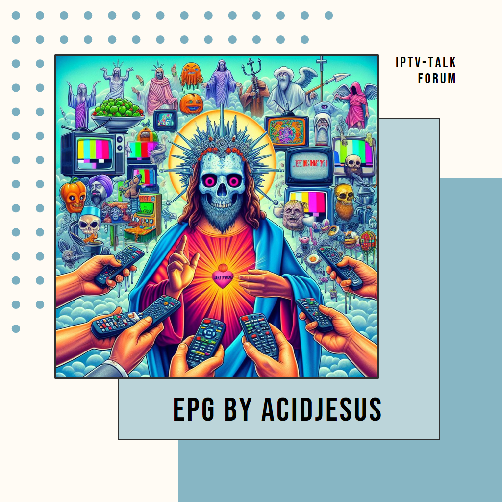

 

🇺🇸 &nbsp;**Canales EE.UU.**&nbsp;
•&nbsp;
🇬🇧 &nbsp;**Canales UK**&nbsp;
•&nbsp;
🇲🇽 &nbsp;**Latino / México**&nbsp;
•&nbsp;
📡 &nbsp;**140+ Mercados Locales EE.UU.**

 

> 🌐 **[English version / Versión en inglés →](README.md)**

---

> ⚠️ **Este EPG es gratuito y de uso LEGAL únicamente.**
>
> Las guías de TV no son perfectas, y yo tampoco. Por favor espera **24 horas** antes de reportar un problema — la mayoría se resuelven solos con la actualización nocturna.

---

## 📌 Accesos Rápidos

| | | | |
|:-:|:-:|:-:|:-:|
| [🔗 **Obtener URL**](#-tus-urls-epg) | [⚡ **Configuración**](#-configuración-rápida--60-segundos) | [📊 **Estadísticas**](#-estadísticas-en-vivo) | [📡 **Mercados Locales**](README.md#-us-local-coverage--140-markets) |
| [🏆 **Apps Compatibles**](#-apps-compatibles) | [❓ **Preguntas**](#-preguntas-frecuentes) | [💬 **Comunidad**](#-comunidad--soporte) | [📋 **Estado**](STATUS.md) |

---

## 🟢 Estadísticas en Vivo

> 📊 Las estadísticas se actualizan automáticamente cada noche.
> &nbsp;&nbsp;&nbsp;📋 **[→ Ver Página de Estado Completa](STATUS.md)**

<!-- EPG-STATS-START -->
### 📊 Estadísticas EPG — Última actualización: 2026-07-13 05:56 CDT

| Guía | 📺 Canales | 📄 Programas | 🗓 Cobertura | 📦 Tamaño | 🕒 Actualizado |
|------|-----------|-------------|------------|---------|--------------|
| 🇺🇸🇬🇧🇲🇽 **Combinada** | 1,101 | 30,948 | Jul 13, 06:30 → Jul 14, 07:00 | 40.0 MB | 05:56 AM |
| 🇺🇸 **Guía EE.UU.** | 694 | 116,197 | Jul 12, 04:30 → Jul 18, 23:30 | 14.6 MB | Jul 12 |
| 🇬🇧 **Guía UK** | 529 | 95,963 | Jul 12, 01:20 → Jul 19, 02:00 | 10.9 MB | Jul 12 |
| 🇲🇽 **Latino / México** | 607 | 104,018 | Jul 12, 01:30 → Jul 19, 02:30 | 10.9 MB | Jul 12 |
| 🇺🇸 **EE.UU. Local** | 291 | 29,718 | Jul 13, 01:00 → Jul 15, 10:00 | 2.4 MB | Jul 12 |
<!-- EPG-STATS-END -->

---

## 🌎 Acerca de EPGTalk

### 🚀 9 Años · Miles de Usuarios · 100% Gratis · Nunca Paramos

EPGTalk lleva sirviendo a la comunidad IPTV desde **2017** — creado y mantenido por **una sola persona** por puro amor a la comunidad. Lo que comenzó como una pequeña guía en el foro IPTVTalk ha crecido hasta convertirse en una de las fuentes de EPG gratuitas más completas disponibles.

Ya sea que estés viendo **fútbol americano**, **Premier League**, **EastEnders** o **Liga MX** — esta guía te tiene cubierto con hasta **7 días de programación actualizada**, enviada a GitHub automáticamente cada noche sin falta.

| 🔄 Actualizaciones Diarias | 📅 7 Días de Programación | 📦 Comprimido y Rápido | 🆓 Siempre Gratis | 📡 140+ Mercados Locales |
|:-:|:-:|:-:|:-:|:-:|
| Cada noche sin falta | Planifica toda la semana | `.gz` carga al instante | Sin cuentas, jamás | Cobertura local completa EE.UU. |

---

## 🔗 Tus URLs EPG

> 📋 **Copia tu URL → Pégala en la app → Listo.** Así de simple.

| Guía | Qué Obtienes | Cobertura | URL |
|------|-------------|----------|-----|
| 🇺🇸🇬🇧🇲🇽 **Combinada** | Todo en un archivo | EE.UU. + UK + México | `https://raw.githubusercontent.com/acidjesuz/EPGTalk/master/guide.xml.gz` |
| 🇺🇸 **Guía EE.UU.** | Canales nacionales EE.UU. | 7 días | `https://raw.githubusercontent.com/acidjesuz/EPGTalk/master/US_guide.xml.gz` |
| 🇬🇧 **Guía UK** | Canales nacionales UK | 7 días | `https://raw.githubusercontent.com/acidjesuz/EPGTalk/master/UK_guide.xml.gz` |
| 🇲🇽 **Latino / México** | Canales en español | 7 días | `https://raw.githubusercontent.com/acidjesuz/EPGTalk/master/Latino_guide.xml.gz` |
| 📡 **EE.UU. Local** | 140+ mercados locales | 72 horas | `https://raw.githubusercontent.com/acidjesuz/EPGTalk/master/US_local_guide.xml.gz` |

> 💡 **¿Primera vez?** Empieza con la **Combinada** — todo en una sola URL, funciona con todas las apps.
>
> 📝 **¿Tu app no soporta `.gz`?** Sin problema, usa la versión sin comprimir:
> `https://raw.githubusercontent.com/acidjesuz/EPGTalk/master/guide.xml`

---

## ⚡ Configuración Rápida — 60 Segundos

> ✅ **Compatible con:** TiviMate · Kodi · Perfect Player · GSE IPTV · OTT Navigator · IPTV Smarters · Sparkle TV · Channels DVR · y **cualquier** app compatible con XMLTV

**1️⃣** &nbsp; Abre tu app → **Configuración** → **Guía de TV** o **EPG**

**2️⃣** &nbsp; Toca **Agregar fuente** / **URL EPG** / **Importar guía**

**3️⃣** &nbsp; Pega tu URL de la tabla de arriba

**4️⃣** &nbsp; **Guardar** → Reinicia o actualiza

**5️⃣** &nbsp; 🎉 **¡Programación completa cargada — a disfrutar!**

---

## 🏆 Apps Compatibles

| App | Plataforma | Estado |
|-----|-----------|--------|
| **TiviMate** | Android / Android TV | ✅ Totalmente Compatible — La Más Recomendada |
| **Kodi** | Windows / Mac / Linux / Android / iOS | ✅ Totalmente Compatible |
| **Perfect Player** | Android | ✅ Totalmente Compatible |
| **OTT Navigator** | Android / Android TV | ✅ Totalmente Compatible |
| **GSE IPTV** | iOS / Android | ✅ Totalmente Compatible |
| **IPTV Smarters** | Todas las plataformas | ✅ Totalmente Compatible |
| **Sparkle TV** | iOS / Apple TV | ✅ Totalmente Compatible |
| **Channels DVR** | Todas las plataformas | ✅ Totalmente Compatible |

> 💡 **¿Tu app no está en la lista?** Si acepta una **URL EPG XMLTV** — funciona con EPGTalk. Eso es el 99% de las apps IPTV.

---

## 📡 Cobertura Local EE.UU. — 140+ Mercados

<strong>🗺️ Haz clic para ver todos los mercados cubiertos</strong>

 

| | | | |
|---|---|---|---|
| 📡 Abilene TX | 📡 Albany NY | 📡 Albuquerque NM | 📡 Altoona PA |
| 📡 Ames IA | 📡 Anchorage AK | 📡 Annapolis MD | 📡 Atlanta GA |
| 📡 Augusta GA | 📡 Austin TX | 📡 Baltimore MD | 📡 Bangor ME |
| 📡 Baton Rouge LA | 📡 Beaumont TX | 📡 Boise ID | 📡 Boston MA |
| 📡 Buffalo NY | 📡 Cape Girardeau MO | 📡 Cedar Rapids IA | 📡 Charleston SC |
| 📡 Charlotte NC | 📡 Chattanooga TN | 📡 Chicago IL | 📡 Cincinnati OH |
| 📡 Cleveland OH | 📡 Colorado Springs CO | 📡 Columbia SC | 📡 Columbus OH |
| 📡 Corpus Christi TX | 📡 Dallas TX | 📡 Dayton OH | 📡 Denver CO |
| 📡 Detroit MI | 📡 Dothan AL | 📡 Duluth MN | 📡 El Paso TX |
| 📡 Fairbanks AK | 📡 Flint MI | 📡 Fort Myers FL | 📡 Fort Smith AR |
| 📡 Fort Worth TX | 📡 Fresno CA | 📡 Grand Junction CO | 📡 Grand Rapids MI |
| 📡 Green Bay WI | 📡 Greensboro NC | 📡 Greenville SC | 📡 Hamtramck MI |
| 📡 Hardeeville SC | 📡 Harrisburg PA | 📡 Harrisonburg VA | 📡 Hartford CT |
| 📡 Hawaii HI | 📡 Houston TX | 📡 Huntsville AL | 📡 Indianapolis IN |
| 📡 Jacksonville FL | 📡 Jackson MS | 📡 Jefferson City MO | 📡 Johnson City TN |
| 📡 Kansas City MO | 📡 Kirksville MO | 📡 Knoxville TN | 📡 Lansing MI |
| 📡 Laredo TX | 📡 Las Vegas NV | 📡 Lincoln NE | 📡 Little Rock AR |
| 📡 Longview TX | 📡 Los Angeles CA | 📡 Louisville KY | 📡 Lubbock TX |
| 📡 Macon GA | 📡 Madison WI | 📡 Memphis TN | 📡 Mesa AZ |
| 📡 Miami FL | 📡 Milwaukee WI | 📡 Minneapolis MN | 📡 Mobile AL |
| 📡 Monroe LA | 📡 Nashville TN | 📡 New Bern NC | 📡 New Haven CT |
| 📡 New Orleans LA | 📡 New York NY | 📡 Norfolk VA | 📡 Oklahoma City OK |
| 📡 Omaha NE | 📡 Orange Park FL | 📡 Orlando FL | 📡 Ottumwa IA |
| 📡 Panama City FL | 📡 Philadelphia PA | 📡 Phoenix AZ | 📡 Pittsburgh PA |
| 📡 Portland OR | 📡 Providence RI | 📡 Pueblo CO | 📡 Raleigh-Durham NC |
| 📡 Reno NV | 📡 Rhode Island RI | 📡 Richmond VA | 📡 Roanoke VA |
| 📡 Sacramento CA | 📡 Salinas CA | 📡 Salt Lake City UT | 📡 San Antonio TX |
| 📡 San Diego CA | 📡 San Francisco CA | 📡 San Juan PR | 📡 San Luis Obispo CA |
| 📡 Savannah GA | 📡 Seattle WA | 📡 Sedalia MO | 📡 Shreveport LA |
| 📡 Sioux Falls SD | 📡 South Bend IN | 📡 Spokane WA | 📡 Springfield MO |
| 📡 St. Louis MO | 📡 St. Paul MN | 📡 St. Petersburg FL | 📡 Sweetwater TX |
| 📡 Syracuse NY | 📡 Tallahassee FL | 📡 Tampa FL | 📡 Toledo OH |
| 📡 Topeka KS | 📡 Tucson AZ | 📡 Tulsa OK | 📡 Tyler TX |
| 📡 Waco TX | 📡 Washington DC | 📡 West Palm Beach FL | 📡 Wichita KS |
| 📡 Wichita Falls TX | 📡 Wilmington NC | 📡 Youngstown OH | |

> **¿No ves tu ciudad?** La guía cubre afiliadas locales (ABC, NBC, CBS, FOX, PBS, CW y más) para cada mercado listado. Tu área puede estar cubierta por un mercado cercano. ¡Publica una solicitud en el hilo de IPTVTalk!

---

## ❓ Preguntas Frecuentes

<strong>📭 Mi guía no muestra datos — ¿qué hago?</strong>

Asegúrate de usar la URL **raw** de GitHub que comienza con `raw.githubusercontent.com` — NO la URL normal de la página de GitHub. Después de agregar la fuente, cierra completamente y reinicia tu app. Dale unos minutos para descargar — la guía Combinada pesa más de 40 MB.

<strong>📺 Falta un canal o muestra información incorrecta</strong>

Espera **24 horas** — la guía se actualiza cada noche y la mayoría de los problemas se resuelven solos. Si el canal sigue fallando después de 2 días, publica en el hilo de IPTVTalk que está abajo.

<strong>🔄 ¿Con qué frecuencia se actualiza la guía?</strong>

Cada noche, completamente automatizado. El proceso corre de madrugada y para las 9:30 PM (hora del centro de EE.UU.) los datos frescos ya están en GitHub. Configúralo una vez, olvídalo para siempre.

<strong>📦 ¿Debo usar .xml o .xml.gz?</strong>

Siempre `.xml.gz` — son exactamente los mismos datos pero comprimidos, hasta **10 veces más pequeños**. Se descargan más rápido y pesan menos en tu dispositivo. Solo usa `.xml` si tu app específicamente no soporta gzip.

<strong>🌍 ¿Puedo usarlo fuera de EE.UU. / UK / México?</strong>

100% sí — está alojado en el CDN global de GitHub, accesible desde cualquier parte del mundo.

<strong>📡 ¿Cuál es la diferencia entre Guía EE.UU. y EE.UU. Local?</strong>

**Guía EE.UU.** = canales nacionales de cable/satélite (ESPN, CNN, TNT, etc.)
**EE.UU. Local** = afiliadas locales de transmisión (ABC, NBC, CBS, FOX, PBS) en **140+ mercados individuales**. Son cosas diferentes — usa ambas para cobertura máxima.

<strong>🔓 ¿Es legal?</strong>

EPGTalk proporciona datos de programación de TV — piénsalo como una guía digital de canales. Es **solo para uso legal de IPTV**. Asegúrate siempre de que tu servicio IPTV sea legítimo y tenga las licencias correspondientes.

<strong>🤝 ¿Puedo solicitar un canal o contribuir?</strong>

¡Claro que sí! Publica en el hilo del foro IPTVTalk que está abajo. Solicitudes de canales, sugerencias de proveedores, reportes de errores — todo es bienvenido. Esto fue creado por y para la comunidad.

---

## 💬 Comunidad y Soporte

Este proyecto vive en **IPTVTalk** — el hogar de la comunidad IPTV:

🔗 **[EPG para Canales de EE.UU. y UK — Foro IPTVTalk](https://iptvtalk.net/threads/epg-for-us-and-uk-channels.33526/)**

**9 años** de publicaciones, actualizaciones y apoyo comunitario en un solo hilo. Únete, saluda, cuéntale a la gente que la guía te está ayudando — tu apoyo es lo que mantiene esto vivo. 🙏

---

## ⭐ Apoya el Proyecto

EPGTalk es completamente gratuito y **siempre lo será**. Si está mejorando tu experiencia televisiva:

- ⭐ &nbsp;**Dale estrella al repo** — toma 2 segundos, ayuda a que miles lo encuentren
- 📢 &nbsp;**Compártelo** — publícalo en tu grupo de IPTV, foro o Discord
- 🐛 &nbsp;**Reporta errores** — hace la guía mejor para todos
- ☕ &nbsp;**Ten paciencia** — una persona, montañas de café y 9 años de dedicación

---

### *"En un punto de polvo suspendido en un rayo de sol..."*

*En funcionamiento desde **2017** · Creado con ☕ y ❤️ por **aCiDjEsUs-PwA***

 

 

